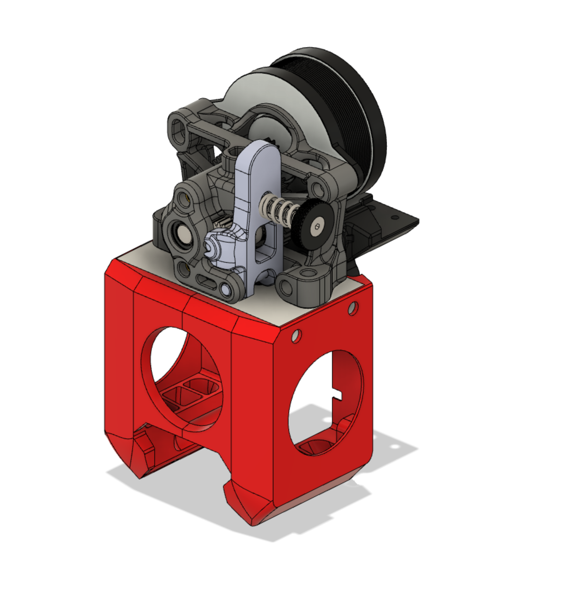
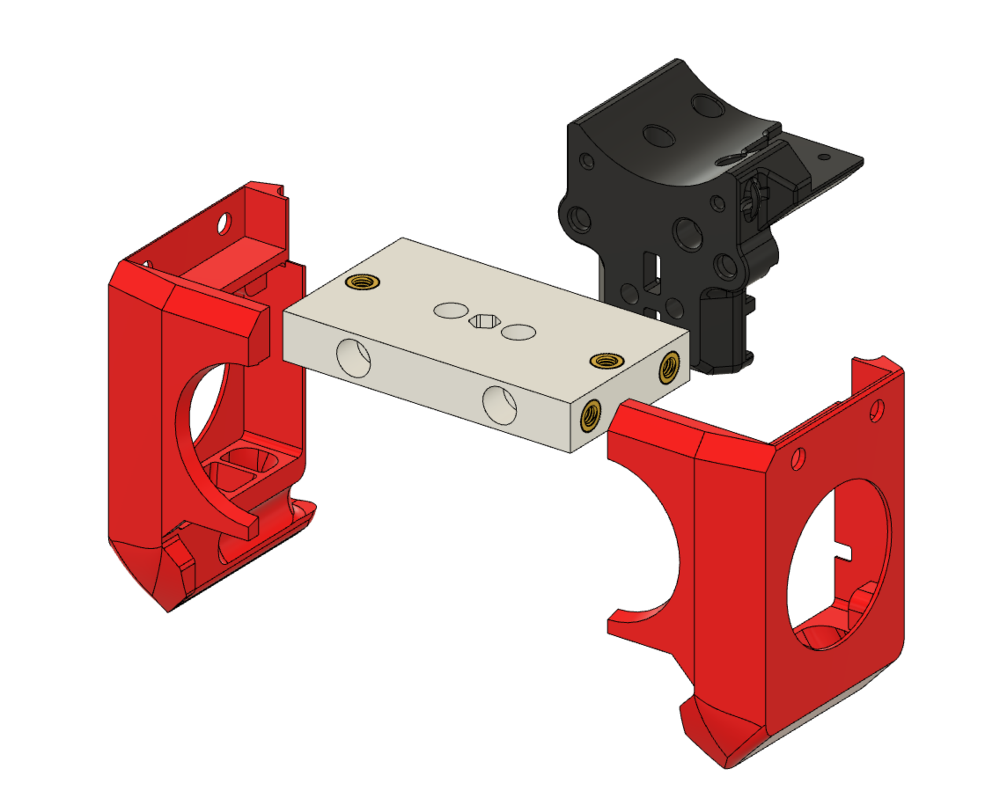

# Sherpa-BLOCKhead Version 0.1

This is an alternate toolhead for the Voron V0.1 using the [Mini-Sherpa](https://github.com/Annex-Engineering/Sherpa_Mini-Extruder) extruder.
This will fit on the stock carriage.

##Build Instructions

Parts Needed
Body and sides
4- M3x6mm BHCS or SHCS
2- M3x30mm BHCS or SCHS
Mounting Mini Shperpa
2- M3x12mm

6- M3x5x5 Threaded inserts

Print all the parts in ABS or ASA.
Inserts go into the body part on the sides and top.

Mount the body onto the X Carriage using the M3-30mm BHCS
Mount the Hotend to the body
Put the fans in the blowers, and mount them to the body using the M3x6mm BHCS

Route the wires and Happy Printing!!
