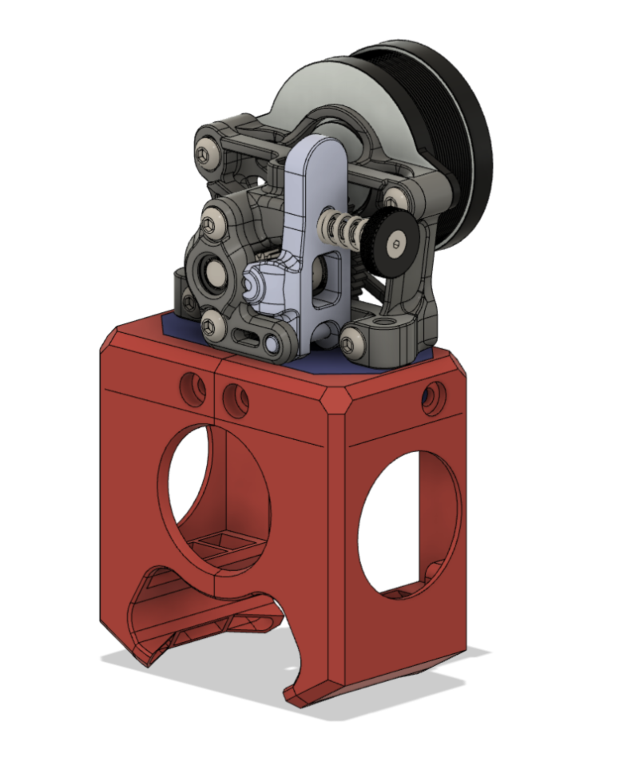
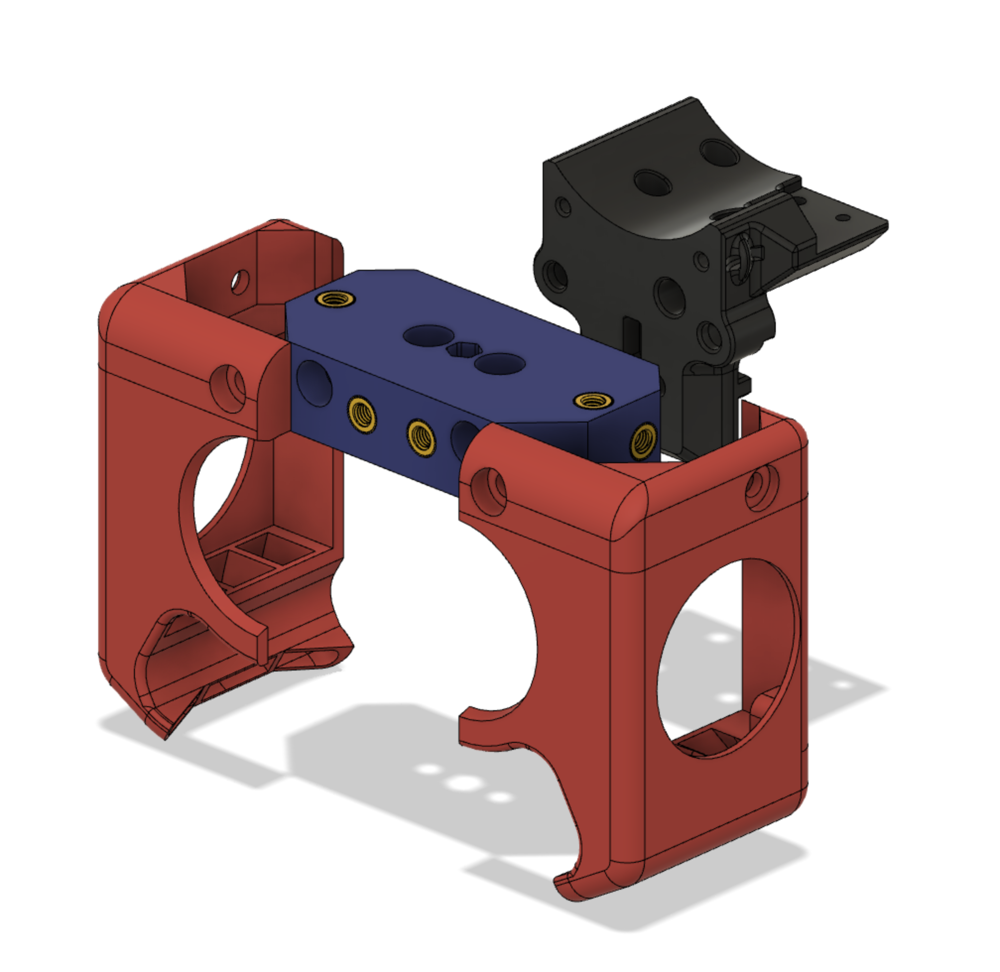

# Sherpa-BLOCKhead Version 0.4

This is an alternate toolhead for the Voron V0.1 using the [Mini-Sherpa](https://github.com/Annex-Engineering/Sherpa_Mini-Extruder) extruder.
This will fit on the stock V0.1 carriage.   
The goal of this project is to have a gantry that fits the Voron 0.1 with a Sherpa mini extruder and provides removable fan ducts so that the hotend is more serviceable.    

We are still at a very early development stage. If you use it, feedback is welcomed.

Pleas check the subdirectories for the various releases. current always has the newest release, older and development versions are labelled.

